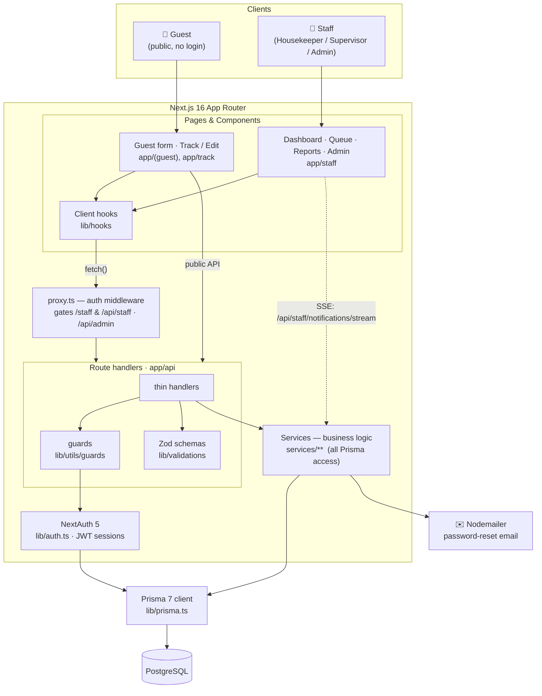

# SALT of Akagera — Laundry Request System

A hotel laundry request system replacing a paper form workflow at SALT of Akagera, Rwanda.
Guests submit laundry requests from their room; laundry staff receive and manage them on a
live dashboard. No payment processing — costs are tracked and added to the room bill at
checkout.

Built with Next.js 16 (App Router), TypeScript, Prisma on PostgreSQL, Tailwind, and
Auth.js v5.

`CLAUDE.md` is the working reference for architecture and conventions.
`docs/soa-migration.md` records how authentication got to be the way it is.

## Getting started

```bash
pnpm install
pnpm prisma migrate dev     # create the schema
pnpm prisma db seed         # catalogue items and SOA-shaped staff accounts
pnpm dev
```

Open [http://localhost:3000](http://localhost:3000) for the guest form. The staff
dashboard is at `/staff` and requires a SOA session — see below.

## Sign-in

The laundry has no login page and stores no passwords. Staff authenticate against SOA
(the hotel's staff platform) and the laundry mirrors their account.

1. An unauthenticated request to any `/staff` page is caught by `proxy.ts` and redirected
   to `SOA_SIGNIN_URL`, carrying a return URL that points back at the laundry's
   `/authenticate` page with the originally requested path folded inside it.
2. SOA signs the person in, checks they hold `LAUNDRY_REQUEST_VIEW`, and redirects to
   `/authenticate?redirect=<path>&token=<jwt>&expiresAt=<unix ms>`.
3. `/authenticate` calls `GET {SOA_API_URL}/api/auth/me` with that bearer token, upserts
   the laundry's copy of the user, builds the session, discards the token, and replaces
   the URL with the original path.

The session expires at exactly the moment SOA's token does, capped at one hour. What each
person can see and do is decided by the `LAUNDRY_*` permissions SOA returns — the laundry
has no roles of its own.

Accounts are created, updated and deactivated only by SOA, calling
`POST /api/integrations/soa/users` and `PATCH /api/integrations/soa/users/[soaId]` with an
`X-SOA-Api-Key` header. No screen in the laundry creates or edits a user.

Guest pages (`/`, `/track`, `/confirmation`) and their APIs are fully public.

## Environment variables

Copy these into `.env.local`.

| Variable | What it is |
|---|---|
| `DATABASE_URL` | PostgreSQL connection string |
| `NEXTAUTH_SECRET` | Secret Auth.js signs the session cookie with |
| `NEXTAUTH_URL` | This app's own origin, for Auth.js |
| `APP_URL` | This app's public origin, used to build the return URL sent to SOA |
| `SOA_API_URL` | Base URL of the SOA API — `/api/auth/me` is appended to it |
| `SOA_SIGNIN_URL` | SOA's sign-in page, where an unauthenticated visitor is sent |
| `SOA_REDIRECT_PARAM` | Name of the query parameter SOA reads the return URL from |
| `SOA_PROFILE_URL` | Where staff manage their own details; linked from `/staff/profile`. Leave empty to hide the link |
| `SOA_PROVISION_API_KEY` | Shared key the provisioning endpoints check `X-SOA-Api-Key` against |

No SOA URL or parameter name is hardcoded anywhere, so pointing the app at the real SOA
instance is a config change and nothing more.

## Scripts

| Command | What it does |
|---|---|
| `pnpm dev` | Development server |
| `pnpm build` | `prisma generate` then a production build |
| `pnpm start` | Serve the production build |
| `pnpm lint` | ESLint |
| `pnpm prisma db seed` | Reseed the catalogue and staff accounts |
# SALT Laundry

A hotel laundry management system for **SALT of Akagera** (Rwanda). Guests submit
laundry requests from their room with no login; staff collect, clean, track, and
return the items through a role-based operations dashboard.

Built with **Next.js 16 (App Router)**, **React 19**, **Prisma 7 / PostgreSQL**,
**NextAuth 5**, and **Tailwind CSS 4**.

---

## Table of contents

- [What it does](#what-it-does)
- [Tech stack](#tech-stack)
- [Quick start](#quick-start)
- [Environment variables](#environment-variables)
- [Scripts](#scripts)
- [Project structure](#project-structure)
- [Core concepts](#core-concepts)
- [Documentation](#documentation)

---

## What it does

There are two audiences, split at the app level.

### Guests (public, no login)
- Fill in a room number, pick items from a catalogue, and choose a service per
  item — **Normal**, **Dry-cleaning**, or **Pressing**.
- Optionally mark the whole order **Express** (+30%) or request **hanging** delivery.
- See a live price breakdown (items → express uplift → 15% VAT → total) and an
  estimated same-day return time.
- Track an order later by its ID or by room number, and edit it while it is still
  `PENDING` (before pickup).

### Staff (authenticated dashboard at `/staff`)
Three roles, each seeing progressively more:

| Role | Can do |
| --- | --- |
| **Housekeeper** | See the request queue and their assigned tasks, advance a request through its lifecycle, add notes. |
| **Supervisor** | Everything a housekeeper can, plus reassign requests, view the live staff overview, and see reports. |
| **Admin** | Everything, plus manage the item catalogue and user accounts (create users, reset passwords, toggle roles). |

Operational features include real-time notifications (Server-Sent Events),
automatic load-balanced assignment to housekeepers, SLA/overdue alerting, PDF
invoices, and revenue/service reporting.

---

## Tech stack

| Layer | Choice |
| --- | --- |
| Framework | Next.js 16 (App Router, React Server Components) |
| Language | TypeScript 5 |
| UI | React 19, Tailwind CSS 4, `lucide-react` icons, Nunito font |
| Auth | NextAuth 5 (Credentials provider, JWT sessions) |
| ORM / DB | Prisma 7 with the `@prisma/adapter-pg` driver adapter → PostgreSQL |
| Validation | Zod 4 + `react-hook-form` |
| Email | Nodemailer (Gmail SMTP) for password-reset links |
| PDF | `jspdf` + `html2canvas` for invoice downloads |

---

## Quick start

**Prerequisites:** Node.js 20+, a PostgreSQL database, and npm.

```bash
# 1. Install dependencies (runs `prisma generate` via postinstall)
npm install

# 2. Create your .env (see the next section) then apply migrations
npx prisma migrate deploy

# 3. Seed the catalogue and the three demo accounts
npx prisma db seed

# 4. Start the dev server
npm run dev
```

Open [http://localhost:3000](http://localhost:3000) for the guest form, or
[http://localhost:3000/staff/login](http://localhost:3000/staff/login) for staff.

**Seeded accounts** (from [`prisma/seed.ts`](prisma/seed.ts)):

| Role | Email | Password |
| --- | --- | --- |
| Admin | `admin@salt.rw` | `Admin1234!` |
| Supervisor | `supervisor@salt.rw` | `Supervisor1234!` |
| Housekeeper | `housekeeper@salt.rw` | `Housekeeper1234!` |

> The seed creates the 23 laundry items **with null prices** — an admin sets
> per-service prices in the catalogue before orders can be priced.

---

## Environment variables

Create a `.env` (and `.env.local` for demo flags) in the project root:

| Variable | Purpose |
| --- | --- |
| `DATABASE_URL` | PostgreSQL connection string. |
| `NEXTAUTH_SECRET` | Secret used to sign NextAuth JWTs. |
| `NEXTAUTH_URL` | Base URL of the app for NextAuth callbacks. |
| `APP_URL` | Absolute base URL, used for Open Graph images and reset-link emails. |
| `GMAIL_USER` | Gmail address used to send password-reset emails. |
| `GMAIL_APP_PASSWORD` | Gmail app password for SMTP. |
| `DEMO_MODE` | **Testing only.** `true` bypasses the password check server-side. |
| `NEXT_PUBLIC_DEMO_MODE` | **Testing only.** `true` enables `?email=` auto-login and the demo banner. |

> ⚠️ **Never set `DEMO_MODE` / `NEXT_PUBLIC_DEMO_MODE` in production** — they
> disable password verification. See [Demo mode](docs/DEVELOPMENT.md#demo-mode).

---

## Scripts

| Command | Description |
| --- | --- |
| `npm run dev` | Start the Next.js dev server. |
| `npm run build` | `prisma generate` then production build. |
| `npm start` | Serve the production build. |
| `npm run lint` | Run ESLint. |
| `npx prisma migrate dev` | Create/apply a migration in development. |
| `npx prisma db seed` | Seed catalogue items and demo users. |
| `npx prisma studio` | Open Prisma Studio to browse the database. |

---

## Project structure

```
salt-laundry/
├── app/                    # Next.js App Router — routes, layouts, API handlers
│   ├── (guest)/            # Public guest request form (route group)
│   ├── track/              # Order tracking + guest edit
│   ├── confirmation/       # Post-submit confirmation
│   ├── staff/              # Authenticated dashboard (login, queue, admin, etc.)
│   └── api/                # Route handlers (guest, staff, admin, supervisor, auth)
├── components/             # React components, grouped by audience
│   ├── guest/  staff/  admin/  track/  ui/
├── lib/
│   ├── auth.ts             # NextAuth configuration
│   ├── prisma.ts           # Prisma client singleton
│   ├── constants/          # Roles, statuses, services, pricing, navigation…
│   ├── hooks/              # Client-side data-fetching & UI hooks
│   ├── types/              # Shared TypeScript types
│   ├── utils/              # Pure helpers (pricing, SLA, formatting…)
│   └── validations/        # Zod schemas (shared client + server)
├── services/               # Server-side business logic (DB access lives here)
├── prisma/
│   ├── schema.prisma       # Data model
│   ├── migrations/         # SQL migration history
│   └── seed.ts             # Catalogue + demo user seed
├── proxy.ts                # Auth middleware (route protection)
└── public/                 # Static assets
```

**The layering rule:** `app/api/*` route handlers stay thin — they authenticate
(via [`lib/utils/guards.ts`](lib/utils/guards.ts)), validate input with a Zod
schema, then delegate to a function in `services/`. All Prisma access lives in
`services/`. See [docs/ARCHITECTURE.md](docs/ARCHITECTURE.md).

---

## Architecture at a glance



---

## Core concepts

- **Request lifecycle:** `PENDING → COLLECTED → IN_PROGRESS → READY → DELIVERED`,
  with `CANCELLED` reachable from any active state. Transitions are enforced
  server-side.
- **Money is stored in integer minor units** (Rwandan francs, no decimals). VAT
  is 15%, the express surcharge is 30%.
- **Assignment:** new requests are auto-assigned to the least-busy available
  housekeeper; only a supervisor can reassign afterward.
- **SLA alerts:** requests are flagged `at_risk`, `pickup_overdue`,
  `return_overdue`, or `deadline_missed` based on service-type return deadlines.
- **Auth gating:** [`proxy.ts`](proxy.ts) protects `/staff/**` and the staff/admin
  APIs, and forces users on a temporary password to the change-password screen.

Full detail on each lives in [docs/DOMAIN.md](docs/DOMAIN.md).

---

## Documentation

| Doc | Contents |
| --- | --- |
| [docs/ARCHITECTURE.md](docs/ARCHITECTURE.md) | App layering, request flow, directory conventions, real-time notifications. |
| [docs/DOMAIN.md](docs/DOMAIN.md) | Roles, request statuses & transitions, services, pricing, SLA alerts, assignment. |
| [docs/DATABASE.md](docs/DATABASE.md) | Prisma models, relations, enums, and migration history. |
| [docs/API.md](docs/API.md) | Every API route, its method, auth requirement, and purpose. |
| [docs/DEVELOPMENT.md](docs/DEVELOPMENT.md) | Local setup, env vars, demo mode, seeding, coding conventions. |
